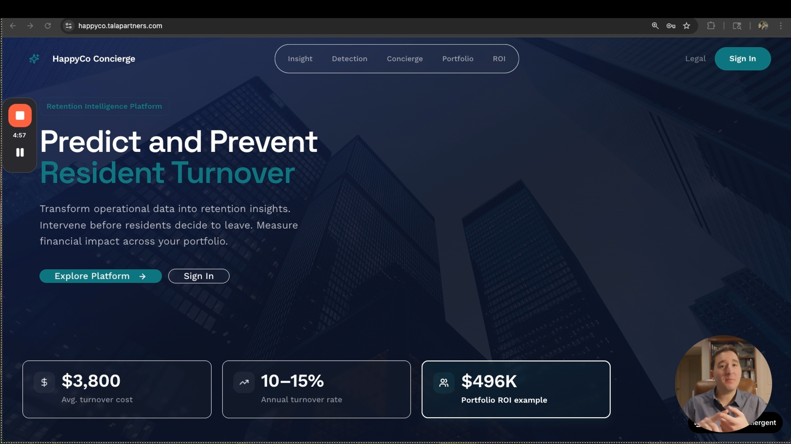
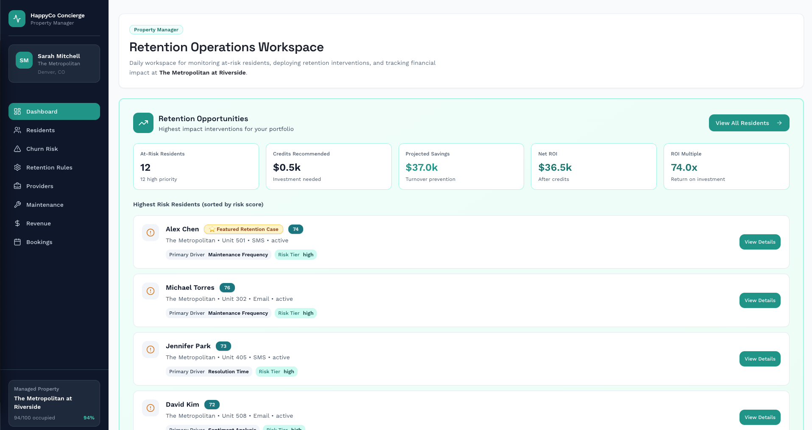
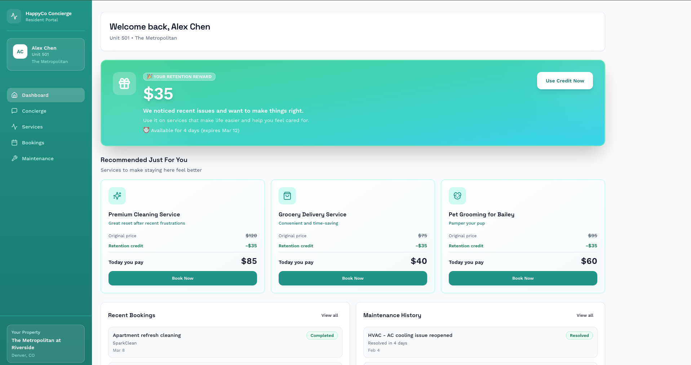
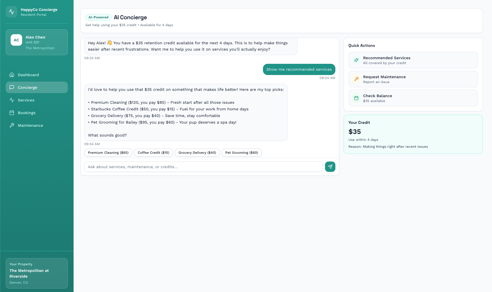

# HappyCo Resident Retention Platform

Live application  
https://happyco.talapartners.com/

## What this project is

HappyCo Resident Retention is a public product case study that shows how AI signals and operational workflows can help property teams reduce resident turnover.

The product is designed to help teams spot resident risk earlier, coordinate interventions, and improve retention through service recovery, support workflows, and better visibility.

This repository is built to show product management ability, not just code.

## Product Walkthrough

Short demo showing the retention intelligence workflow and product thinking behind the system.

### What the demo covers

1. How residents are prioritized by churn risk  
2. How operational drivers explain the risk signal  
3. How the system recommends intervention actions  
4. How projected savings and ROI guide decisions  

Direct video link (opens in new tab)

<a href="https://youtu.be/lPwLeqQauww" target="_blank">Watch the walkthrough</a>

## Product Screens

### Manager Dashboard

Shows at risk residents, recommended retention actions, and projected financial impact.

### Resident Concierge Experience

Resident facing interface where interventions are delivered through service support and retention credits.

### Service Booking Experience

Residents can apply retention credits toward services that improve their experience.

## System Architecture

The resident retention platform combines resident risk scoring, friction driver analysis, intervention workflows, and financial impact modeling.

Core flow

Resident Data → Risk Signals → Friction Drivers → Intervention Engine → Retention ROI Tracking

### Main Components

**Resident Risk Signals**  
Identifies residents showing patterns associated with dissatisfaction or increased churn risk.

**Friction Driver Analysis**  
Highlights the main operational or service issues contributing to retention risk.

**Intervention Engine**  
Maps residents into recommended action tiers such as outreach, concierge support, or retention credits.

**Retention ROI Tracking**  
Estimates projected savings, credit cost, and net return from intervention decisions.

## The problem

Property teams often realize a resident is at risk too late.

Signals are scattered across service issues, complaints, leasing activity, and team notes.

Even when risk is noticed, the follow up process is often manual, inconsistent, and hard to track.

This creates real business problems:

1. preventable resident turnover
2. inconsistent retention actions
3. weak visibility into what is working
4. reactive instead of proactive operations

## The product approach

This platform brings together:

1. resident risk visibility
2. intervention workflows
3. service booking
4. retention credits
5. manager dashboards

The goal is to give property teams one system for identifying risk and taking action early.

## Core workflow

1. identify an at risk resident
2. review resident details and service history
3. trigger an intervention
4. offer support, booking, or credits
5. track follow through and outcome

## Primary users

### Property Manager

Uses the platform to review resident issues, trigger interventions, and improve resident experience.

### Operations Manager

Uses the platform to track team follow through and monitor retention activity.

### Asset Manager

Uses the platform to understand retention trends and intervention results.

## What this repository demonstrates

This repository is meant to show:

1. product problem framing
2. user workflow design
3. technical collaboration
4. prioritization and tradeoffs
5. roadmap thinking
6. product communication

## Repository guide

Planned product documents:

1. `docs/problem-statement.md`
2. `docs/personas.md`
3. `docs/prd.md`
4. `docs/workflows.md`
5. `docs/metrics.md`
6. `docs/decision-log.md`
7. `docs/roadmap.md`

## Technical structure

The application includes a frontend, backend, database workflows, and a live deployment for demonstration.

## Why this exists

A large share of my highest value product work cannot be shared publicly.

This repository is designed as a public case study to show how I think through a product problem, define the workflow, work across technical systems, and structure a product for delivery.

## Product Design Goals

The platform is designed around three product principles.

Early Risk Detection  
Surface churn signals before dissatisfaction becomes irreversible.

Operational Explainability  
Show the drivers behind each risk score so property teams understand why residents are flagged.

Actionable Workflows  
Prediction alone is not enough. The product integrates intervention decisions and financial impact modeling directly into the workflow.

## Next product iterations

Future iterations would focus on:

1. stronger churn prediction
2. better intervention recommendations
3. clearer retention analytics
4. deeper property system integrations
5. improved manager reporting
   

## Connect

LinkedIn
https://www.linkedin.com/in/patrickimperato/

GitHub
https://github.com/PatrickImperato
